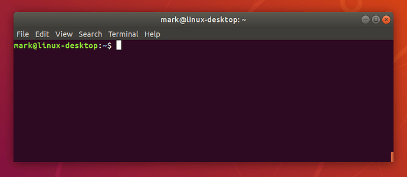

# Introduction

## What is the terminal?

The terminal is this ugly black and white text box:



But what's the purpose of it? Well, when you use your computer, you see this nice UI with graphical elements. But the computer can't understand that. It just knows that you click on this icon, and that when you click on it, it should run the corresponding command to run the program you want.

Let's take a concrete example. On Ubuntu, install Firefox (it should be installed by default). So if you click on the Firefox icon, it will open a Firefox window. If you want to now what's happening behind the scenes, you can run `firefox` in your terminal. You get the exact same result!

It's because that's what your system does! It only runs commands.

## Why use the terminal then?

* It's way more powerful than what your UI
* It allows you to use tools and do stuff that you can't do only with your UI.
* When you will want to deploy your code on a server, you will not have any UI to do it. You will need to set-up everything directly using command lines.
* When you start using it, it becomes addictive :) and you improve your productivity.

## Where to start?

The first step would be to learn how the terminal works.

Let's analyse the first line you see:

```bash
maxim@maxim-computer: ~$
```

What does it mean?!

Calm down, in fact it's simple.

* `maxim`, the leftmost part, is your session user. The one that you connect to when you log into your computer.
* `@` is a separator between the user and the machine's name.
* `maxim-pc:` is your computer's name.
* `~` is the path where you are. By default your terminal starts in your home directory, which is most often located in `/home/<YOU_USER>`. The symbol `~` is associated to it.
* `$` is to say that you're in normal mode. The other possibility to replace this symbol is `#` it would means that you're in `sudo mode`. A mode where all the commands are run as `root`. It means as a super-user that has all the rights on your computer.

Great! Now you know what that line means! We can move on. You will start typing commands.

## Man

For each command that exists, there is a documentation integrated to the terminal. Just type `man` followed by any comment and it will show you the documentation.

## List files

If you want to know which files and folders are in your current directory (remember, by default you will be in your home directory), you can use the `ls` command.

Try it!

As you can see there are a bunch of files in your home directory like `Desktop`, `Downloads`, `Pictures`,...

**Pro tips:** You can also add a path after ls. For example if I want to see the content of the folder `becode` which is in the folder `Desktop`:

```bash
ls Desktop/becode
```

## Move!

If you wan to see what's inside your Desktop folder for example, you can tell your terminal to move into this directory. To do so, you can use the `cd` command followed by the folder's name you want to go to. So to get back one folder

```bash
cd Desktop
```
Now you should see a new folder at the start of the new line:

```bash
maxim@maxim-computer: ~/Desktop$
```

To go up a folder in the directory structure you can use

```bash
cd ..
```

**Pro tips:** If you want to come back to your home directory, type `cd` alone. It will do the job.

It shows you where you are in your machine. Try `ls` now. Are there any files on your Desktop?

If not, let's create one!

## Create a file

To create a file you can type `touch` followed by your file's name:
Let's create a test.txt file on your desktop

```bash
touch test.txt
```

Now you can do `ls` to see if the file has been created.

## Create a folder

If you want to create a new folder, you can use the `mkdir` followed by the dir's name.

```bash
mkdir test_folder
```

## Remove a file

You don't want our test file and directory to stay there for ever.
To delete them, you can use the `rm` command followed by your file/folder. If you try to delete a folder or a folder that contains files you will get an error. I let you google what has to be done to do so.

## Find a file

Let's say you are in a folder that contains a lots of other folders and files and you know that there is a file somewhere that contains `becode` in its name.

You could use `find`.

## Show file contents

From the terminal, you can print the content of a file.
`cat myfile.txt`

## Find a line in a file

You want to see the line where a word is in?
Just use `grep` ! You can concatenate this command with any command that outputs something.

For example if I want to see if my file contains `learning` and see the context around it, I could type:

```bash

cat myfile.txt | grep "learning"
```

Here the pipe `|` is used to concatenate two commands.

## Sudo

Some commands will need some elevated priviledges to be executed. For example,  if you want to install a new software. Your computer will ask you to run the command as `sudo`, which means as administrator of the system (also called root).

**Pro Tips:** If you want to apply sudo to the last command you typed, try using the following:

```bash
sudo !!
```

It will re-run the last command with sudo infront.
